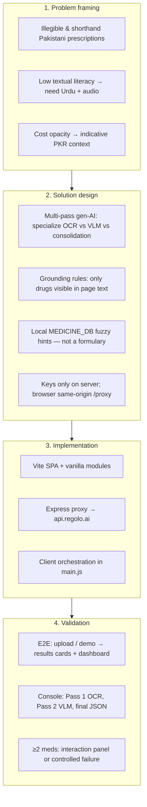
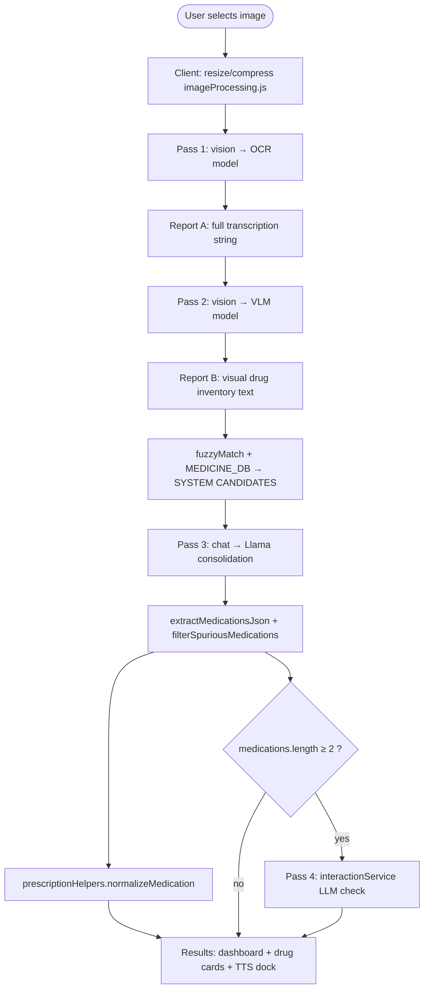
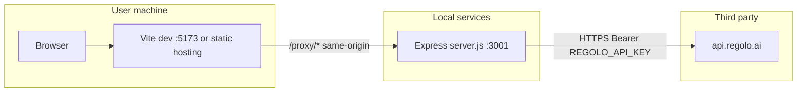
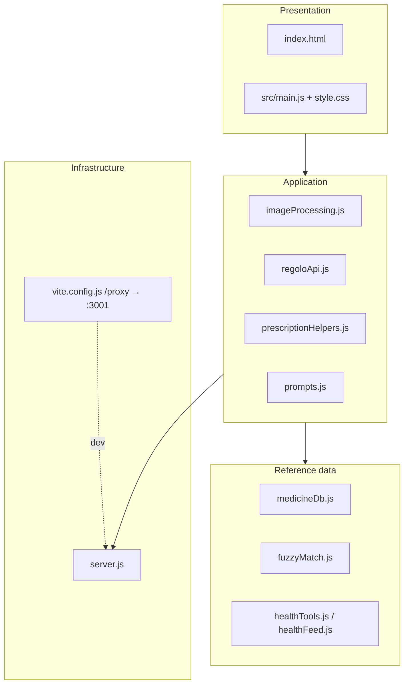

# Sehat Saathi — Technical Reproduction Guide

**AI-Powered Prescription Intelligence for Pakistan** · Engineering & methodology reference

| | |
|:---|:---|
| **Audience** | Engineers, reviewers, and judges who must **clone, run, and verify** the system |
| **Companion docs** | [README.md](README.md) (full product narrative), [PRODUCT_SPECIFICATION.md](PRODUCT_SPECIFICATION.md) (cover & team) |
| **Programme** | HEC ASPIRE PK — Hackathon, Cohort 3 |
| **Version** | 1.0 · April 2026 |

This document is **directional**: follow sections in order for a **deterministic** local reproduction. It adds **methodology** diagrams that are not repeated in full elsewhere.

---

## 1. Purpose

Reproduce **Sehat Saathi** end-to-end: a browser client that sends a prescription image through a **local Express proxy** to **Regolo AI**, runs a **fixed three-pass model pipeline** (plus an optional fourth pass for drug–interaction hints), and renders **normalized medication JSON** in the UI with dashboard, TTS, and tools.

**Out of scope for this guide:** production hardening, PHI storage, or replacing Regolo with another provider (possible with proxy changes only).

---

## 2. Methodology (research → delivery)

High-level **how the product was approached**, before runtime detail.



---

## 3. Runtime AI pipeline (methodology diagram)

**Ordered steps** the application performs for **one scan**. Numbers align with UI processing phases and console logs.



| Step | Source file(s) | Model ID (`src/config.js`) | Output |
|:---:|:---|:---|:---|
| Image prep | `src/utils/imageProcessing.js` | — | Base64 image within size/type limits |
| Pass 1 OCR | `src/services/regoloApi.js` → proxy | `deepseek-ocr-2` | Raw OCR string |
| Pass 2 VLM | same | `qwen3.5-122b` | VLM reasoning string |
| Fuzzy hints | `src/utils/fuzzyMatch.js`, `src/data/medicineDb.js` | — | Candidate brand strings for prompt |
| Pass 3 consolidate | `src/main.js`, `src/utils/prompts.js` | `Llama-3.3-70B-Instruct` | JSON array of medicines |
| Pass 4 interactions | `src/services/interactionService.js` | same API, interaction prompt | Structured pairs / empty / error flag |
| Normalize & cost | `src/utils/prescriptionHelpers.js` | — | UI-ready fields + aggregates |

---

## 4. System context (deployment view)



In **development**, run **both** Vite and Express (`npm run dev:all`). The browser **never** holds `REGOLO_API_KEY`.

---

## 5. Layered architecture (reproduction mental model)



---

## 6. Reproduction procedure (step-by-step)

### 6.1 Prerequisites

| Requirement | Notes |
|-------------|--------|
| **Node.js** | ≥ **18** (LTS recommended) |
| **npm** | Bundled with Node |
| **Regolo API key** | [regolo.ai](https://regolo.ai/) — `REGOLO_API_KEY` |
| **OS** | Windows, macOS, or Linux (commands below show **PowerShell**; adapt for bash) |

### 6.2 Obtain source

```powershell
git clone https://github.com/tayyabrehman96/HEC-Generative-AI-Training-Hackathon.git
cd HEC-Generative-AI-Training-Hackathon
```

*(If your folder is named `Sehat AI`, use that path consistently.)*

### 6.3 Configure secrets

```powershell
copy .env.example .env
```

Edit `.env` and set:

```env
REGOLO_API_KEY=<your_key>
```

**Do not** expose this key in the browser bundle; only `server.js` reads it.

### 6.4 Install dependencies

```powershell
npm install
```

### 6.5 Run the full stack (recommended)

```powershell
npm run dev:all
```

This starts:

| Process | Default URL | Role |
|---------|-------------|------|
| **Express proxy** | `http://127.0.0.1:3001` | Forwards `/proxy/chat/completions` to Regolo |
| **Vite** | `http://localhost:5173` | SPA + **rewrites** `/proxy` → `127.0.0.1:3001` |

If port **5173** is busy, Vite may bind **5174** or the next free port — use the URL printed in the terminal.

### 6.6 Verify wiring (before scanning)

**Health check via Vite (same-origin as the app):**

```powershell
Invoke-WebRequest -Uri "http://localhost:5173/proxy/health" -UseBasicParsing
```

Expect JSON: `{"ok":true,"service":"sehat-saathi-proxy",...}`.

**Direct proxy check:**

```powershell
Invoke-WebRequest -Uri "http://127.0.0.1:3001/proxy/health" -UseBasicParsing
```

If these fail: ensure **only one** proxy instance on **3001**, firewall allows localhost, and `.env` is present when starting `server.js`.

### 6.7 Functional acceptance (manual)

1. Open the Vite **Local** URL in Chromium-based browser (recommended for Urdu TTS).
2. Complete login stub → **landing** → **upload** (or **Try Demo** if configured).
3. After analysis: **≥1 drug card**, **dashboard** visible, console shows **`Pass 1 (OCR)`**, **`Pass 2 (VLM)`**, **`Final Result`**.
4. Optional: prescription with **≥2 medicines** → **interaction** panel appears (or explicit “check failed” message with pharmacist reminder).
5. **صحت ٹولز**: BMI calculator and helpline table render.

---

## 7. Configuration matrix (`src/config.js`)

| Key | Typical value | Role |
|-----|----------------|------|
| `API_BASE_URL` | `/proxy` | Client posts here; Vite proxies to Express |
| `OCR_MODEL` | `deepseek-ocr-2` | Pass 1 |
| `VLM_MODEL` | `qwen3.5-122b` | Pass 2 |
| `MEDICAL_MODEL` | `Llama-3.3-70B-Instruct` | Pass 3 (+ interaction pass via same client) |
| `OCR_SETTINGS` / `VLM_SETTINGS` / `MEDICAL_CONSOLIDATION_SETTINGS` | temperature, max_tokens | Tuned per pass |
| `INTERACTION_SETTINGS` | temperature, max_tokens | Interaction LLM call |

Override base URL for split hosting:

```env
VITE_API_BASE_URL=https://your-host.example.com
```

(Deploy must expose the same **OpenAI-compatible** paths the client expects under that base.)

---

## 8. Scripts reference

| Command | Use |
|---------|-----|
| `npm run dev:all` | **Reproduction default** — proxy + Vite |
| `npm run dev` | Front-end only (API calls fail unless proxy runs separately) |
| `npm run proxy` | Proxy only |
| `npm run build` | Static output → `dist/` |
| `npm run preview` | Serve `dist/` (see `vite.config.js` for `/proxy`) |

---

## 9. Production-oriented notes (not required for hackathon demo)

- Serve `dist/` behind HTTPS; run **Express** (or equivalent gateway) on the **same origin** or configure CORS + `VITE_API_BASE_URL`.
- Rotate `REGOLO_API_KEY`; never commit live keys to **public** repositories.
- Add rate limiting and request size caps on the proxy in real deployments.

---

## 10. Troubleshooting

| Symptom | Likely cause | Action |
|---------|--------------|--------|
| `Missing REGOLO_API_KEY` on start | `.env` missing or empty | Copy `.env.example` → `.env`, set key |
| `Port 3001` in use | Another `server.js` or app | Stop duplicate process or change `PORT` in `server.js` (and Vite proxy target) |
| Vite port conflict | 5173+ taken | Use URL Vite prints; or free ports |
| CORS / failed fetch | Browser calling Regolo directly | Always use **`/proxy`** path via Vite or deployed proxy |
| Empty `medications[]` | Poor image / model output | Sharper photo; check console raw Pass 1–2 text |
| Interaction always error | API timeout or key | Check network tab; verify Regolo quota |

---

## 11. Document control

| Version | Date | Changes |
|:---:|:---|:---|
| 1.0 | April 2026 | Initial technical reproduction guide + methodology diagrams |

---

*For narrative, judging rubric, and deep dives on MEDICINE_DB and PKR logic, see **[README.md](README.md)**.*
